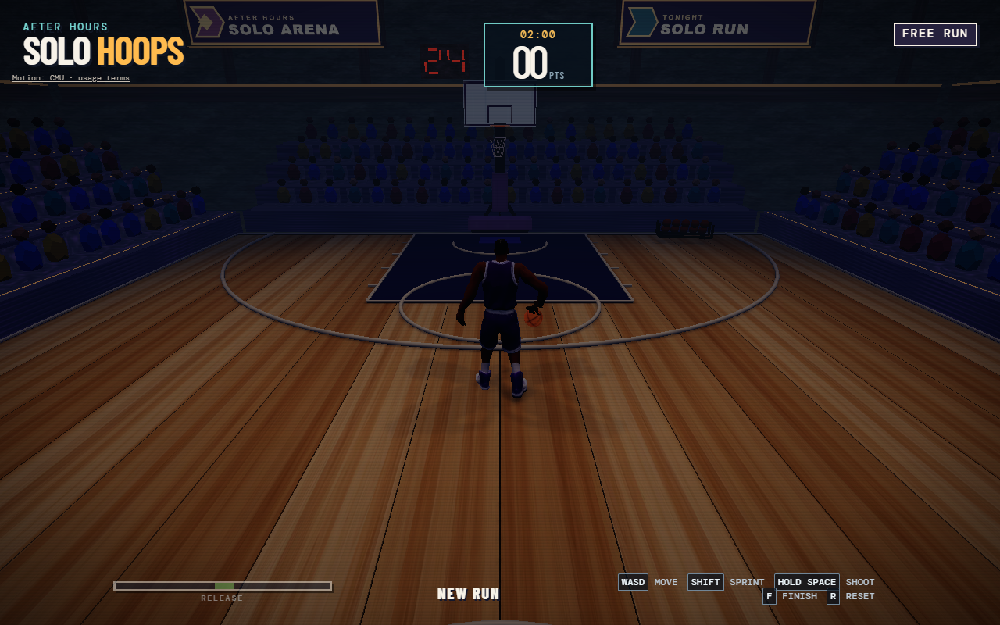
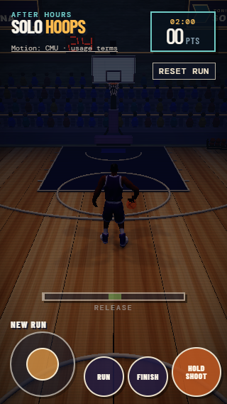
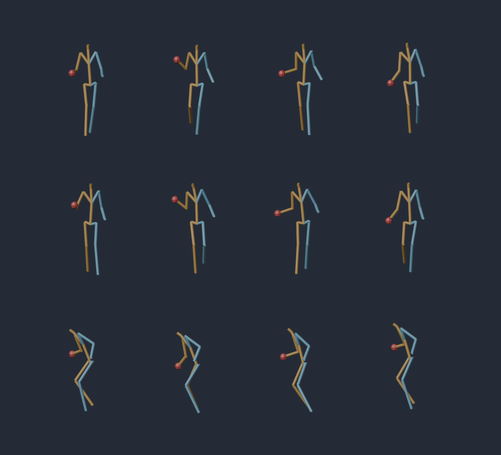
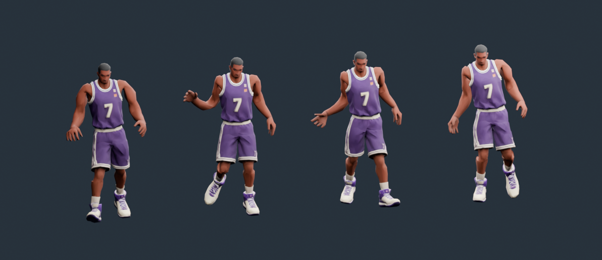

# Hybrid forward-dribble experiment

> Historical, superseded by Luke Part 1. The URLs, old-model fallback claims,
> scripts, clip paths and measurements below describe the previous build.
> Neither the old player nor this incompatible companion is shipped or loaded.
> Luke-specific animation is pending Part 2; this record is retained for source
> terms, audit and comparison only. See [Luke's contract](PLAYER_ASSET.md).

Use [the opt-in preview](https://vindigit.github.io/TheArena/?animation=hybrid), or
`http://127.0.0.1:5174/?animation=hybrid` when Vite uses port 5174. The ordinary URL
keeps the accepted fictional v2 player's procedural animation.
`?player=luke&animation=hybrid` keeps Luke's existing procedural animation.
The companion is a **preview**, not an accepted replacement player asset.

## Ownership and integration

`src/player.js` accepts optional `animationMode` and `animationUrl` configuration.
`group.userData.animationReady` and `animationStatus` track animation independently
of model readiness. Missing, malformed, oversized, incompatible, or non-looping
animation retains the accepted skeletal player's procedural pose. The original
procedural player remains the model-loading/error fallback. The mesh, stable
attachments, and existing action interface are preserved.

`src/player-hybrid.js` caches quaternion interpolants. After the pose adapter's
rest reset and normal procedural pose, it blends the clip over approximately
100 ms only during movement with a dribbling ball. Upper-body rhythm maps the
game's bounce clock to authored apex markers; gait advances from actual root
displacement divided by recorded stride distance. Separate clocks accommodate
multiple bounces per stride without making movement follow the clip.

Procedural corrections reorient and bound source stride excursion, scale crouch
with speed, bound torso lean, and solve two-bone legs. Stance feet hold world
targets with short acquisition/release feathers. Turns over 45 degrees,
unreachable targets, inactive actions, and resets/teleports release plants. A
stationary root freezes gait even if speed is decaying or court clamps apply.

After `updateBall`, `src/main.js` calls presentation-only
`updateDribbleContact({ballPosition, ballRadius, dribblePhase, ballMode})`. Within
±0.35 radians of apex, the right palm solves to the authoritative ball's top
surface; correction fades out by ±0.9 radians. Movement, facing, possession,
ball position, bounce phase, scoring, and action timing remain game-owned.
Other action poses remain authoritative. No animation event changes gameplay.

## Source selection and terms

The motion is CMU subject 06's optical basketball capture, through
**CMU → Bruce Hahne/cgspeed BVH → RancidMilk FBX → gbionics bones-only mirror**.
The Hugging Face revision is pinned to
`d18e9d3d14c08318eaa6c0602a6ead7fac40e58c`.

| Clip | Guidance | Blender frames | Cycle | Weighted seam score | Largest raw global seam | Stride |
| --- | --- | --- | --- | --- | --- | --- |
| 06_02 | Forward, selected | 110–140 | 1.000 s | 7.29° | 20.39° | 1.3555 m |
| 06_03 | Forward comparison | 97–128 | 1.033 s | 10.10° | 23.47° | 1.2912 m |
| 06_08 | Sideways guidance | 58–85 | 0.900 s | 27.04° | 73.25° | 1.1858 m |

The score weights leg seams most heavily and includes right-hand height error.
06_02 requires the least seam correction and has a settled forward gait. 06_08
has a deeper lateral crouch and unsuitable forward heading; it supplies visual
guidance only. Frames come from actual keys: 06_02's meaningful keys end at
5.3333 s, although its declared take extends to 6.0083 s. The unanimated tail
is excluded. Selected source time is 3.6333–4.6333 s.

| Pinned source | SHA-256 |
| --- | --- |
| [06_02.fbx](https://huggingface.co/datasets/gbionics/cmu-fbx/resolve/d18e9d3d14c08318eaa6c0602a6ead7fac40e58c/animations/06_02.fbx) | `13db9d5409a19621b8fa4ab60826f1a9c9bcda1104871986afcb8c86d4278380` |
| [06_03.fbx](https://huggingface.co/datasets/gbionics/cmu-fbx/resolve/d18e9d3d14c08318eaa6c0602a6ead7fac40e58c/animations/06_03.fbx) | `b484069d167e4050ebee1656fd11d8a3b569e98ef8c0c315c43cfb050c89d43d` |
| [06_08.fbx](https://huggingface.co/datasets/gbionics/cmu-fbx/resolve/d18e9d3d14c08318eaa6c0602a6ead7fac40e58c/animations/06_08.fbx) | `093c9cf7304ef32515fcc0525085c8a62ce3626ea5a652b26632d9fe4ab6bf7d` |

Terms were verified September 30, 2026 before adding the companion. The
[CMU terms](http://mocap.cs.cmu.edu/) and [FAQ](http://mocap.cs.cmu.edu/faqs.php)
permit copying, modification, redistribution, and inclusion in commercial
products; direct resale of motion data, including conversions, is prohibited.
[cgspeed's conversion readme](https://sites.google.com/a/cgspeed.com/cgspeed/motion-capture/the-motionbuilder-friendly-bvh-conversion-release-of-cmus-motion-capture-database/readme-file-for-the-bvh-conversion-release)
adds no restrictions. [RancidMilk's terms](https://rancidmilk.itch.io/free-character-animations)
apply those motion terms to modifications and require making them apparent to
recipients. This motion is not CC0 or MIT. No converter add-on code is reused.

Credits and recipient terms ship in
[`cmu-motion-terms.txt`](../public/assets/models/player/cmu-motion-terms.txt),
linked visibly in the opt-in game. CMU's database was funded by NSF EIA-0196217.
Quaternius supplied the converter's reference rig; its character mesh is not
redistributed here. The manifest contains six primary-source license witnesses,
retrieval statuses, HTML hashes, source/output hashes, and the export recipe.

## Reproducible Blender export

[`scripts/retarget-dribble.py`](../scripts/retarget-dribble.py) is independently
authored and was executed in Blender 5.2.1 LTS in a separate
`Hybrid_Dribble_Experiment` scene against shipped `fictional-player-v2.glb`.
Source FBXs and `retargeted-dribble.blend` stay in ignored `.tmp/hybrid/`.

From the repository root, download the pinned files and run the installed Blender
executable (use its full path if it is not on PATH):

```powershell
New-Item -ItemType Directory -Force .tmp/hybrid | Out-Null
$motionRevision = 'd18e9d3d14c08318eaa6c0602a6ead7fac40e58c'
foreach ($motionClip in @('06_02', '06_03', '06_08')) {
  Invoke-WebRequest "https://huggingface.co/datasets/gbionics/cmu-fbx/resolve/$motionRevision/animations/$motionClip.fbx" -OutFile ".tmp/hybrid/$motionClip.fbx"
}
blender --background --python scripts/retarget-dribble.py
```

The script checks source hashes, corrects FBX import scale, aligns heading, and
retargets world/rest-relative rotations using actual rest axes. Collapsed spine
and shoulder helpers are accounted for through the global rotation chain;
abdomen/chest motion folds into the target chest. It records stride, wrist-height
apex markers, and ankle-height/velocity stance intervals before removing root
motion. Markers are kinematic estimates; the source has no authoritative ball.

The bake distributes endpoint rotation drift and applies a circular three-tap
quaternion filter. It fixes the root, preserves every bind translation, and
exports only 16 non-root rotation channels and curated marker metadata. No
helpers, fingers, mesh, materials, textures, source custom properties, or
position/scale channels are exported. Standard glTF LINEAR quaternion
interpolation uses 31 samples at 30 Hz including both loop endpoints.

| Output measurement | Value |
| --- | --- |
| Asset | `public/assets/models/player/forward-dribble-v1.glb` |
| Bytes / cap | **13,532 / 65,536** |
| SHA-256 | `c4d784a62fe3a44003997600226efab750228a88bc896edead8cec76b8fab7ab` |
| Duration / channels / keys | 1 s / 16 / 496 |
| Loaded endpoint angular discrepancy | 0.0551° maximum, including float normalization |
| Apex / left stance | Phase 0.5333 / 0.3667–0.7667 |
| Right stance | 0.8667–1 plus 0–0.2667, merged across the loop |
| Khronos validation | 0 errors, 0 warnings; 5 expected empty-leaf-node infos |

## Verification results

The fixed-step browser comparison covers 950 updates of walking, sprinting,
stopping, court clamps, 90° turns, and 180° reversals. Root, yaw, ball trajectory
and phase, possession, and score match procedural traces exactly: maximum numeric
delta **0**, tolerance `1e-8`. Changed directions affect displacement on the
same update, including leaving the court boundary.

The skeletal test covers 1,450 updates, finite poses, fixed root/bind lengths, loop continuity,
variable frame steps, resets, and non-dribble contact isolation. It measures
actual skinned shoe-sole vertices and the actual rendered palm attachment,
rather than merely the IK's requested target.

| Steady walk/sprint measurement | Result | Target |
| --- | --- | --- |
| Planted-foot drift, 503 fully planted samples | **1.37 mm** maximum | ≤30 mm |
| Skinned sole floor penetration | Approximately 0 (floating-point residual) | ≤5 mm |
| Palm-to-ball-top error, 82 apex-window samples | <0.001 mm | ≤20 mm |
| Acquired plants over 6 s | Walk 30, sprint 48 | Within 4 of source-distance cadence |

Turn releases are intentional and excluded from steady drift measurements. Old
world targets release immediately on 90°/180° changes; a stance may acquire a
fresh target that update. Regressions with unchanged visual yaw measured
**27.6 cm (90°) and 30.2 cm (180°) replants**, while the sole followed its new
target. These are visible turn snaps. Browser turns/reversals also measure apex palm contact
within 2 cm. Brief swing/plant transitions are not claimed to meet steady metrics.

Existing desktop and touch player checks pass, including gather, shot, layup,
dunk, score/reset, and model fallback. Missing and invalid animation companions
retain the accepted model independently. Actual browser keyboard input, mouse
camera/zoom handlers, coarse-pointer touch events, simultaneous joystick/RUN,
touch cancellation, and camera drag were exercised. Touch targets fit without
overlap at **320×568**, **390×844**, and **844×390**. No control spacing changes
were required. These are browser emulation results; physical phones were not tested.

### Performance

Desktop Chrome, 30 warm-up frames then 180 measured rAF frames; excludes loading.
Pose CPU includes the complete procedural/hybrid pose and post-ball contact.
Frame CPU includes simulation and renderer submission, not GPU completion.
Timings vary with host load; rAF intervals are not physical-phone FPS.

| Mode / viewport | Pose CPU median / p95 | Frame CPU median / p95 | rAF interval median / p95 | Draw calls |
| --- | --- | --- | --- | --- |
| Procedural, 1280×800 | 0.30 / 0.50 ms | 3.80 / 5.60 ms | 16.70 / 16.90 ms | 98 |
| Hybrid, 1280×800 | **0.60 / 1.60 ms** | 4.40 / 7.60 ms | 16.70 / 16.80 ms | **98** |
| Hybrid touch emulation, 390×844 | 0.40 / 0.60 ms | 3.90 / 6.10 ms | 16.70 / 16.80 ms | 78 |

Animation adds **zero draw calls** and no geometry or textures. Touch has a
different camera/frustum; its call count is not a desktop performance comparison.
Physical-phone GPU/thermal behavior and multiplayer budgets remain unmeasured.
Machine-readable evidence is in [`HYBRID_VALIDATION.json`](HYBRID_VALIDATION.json).

Re-run with Node 22+ and an owned local browser:

```powershell
node tests/player.test.mjs
node tests/player-hybrid.test.mjs
node scripts/prepare-player-check.mjs
# Open Vite in agent-browser, then obtain its local CDP WebSocket URL.
node scripts/check-player-browser.mjs <local-CDP-WebSocket-URL> http://127.0.0.1:5174
npm run assets:check
npm run build
npm run build -- --base=/TheArena/
```

The ignored browser harness imports actual gameplay. No production test hooks
are shipped. Both normal and Pages-base production builds pass.

## Visual review and limitations

The forward cycle improves torso/arm rhythm while retaining responsive movement.
Its 1.3555 m stride makes gait cycles about 2.5 Hz at walking speed and 4 Hz at
sprint speed, which looks hurried. Source foot excursions are bounded to rig
reach instead of stretching the skeleton; larger stride scaling needs separate
gait calibration. Immediate turns can visibly release/replant feet. Sideways
motion uses forward guidance rather than a dedicated lateral clip. Raw retarget
soles range from about −3.51 to +4.43 cm relative to the floor; runtime ground
correction is necessary. The clip alone is not a final gait.

Exact palm contact does not guarantee a convincing hand silhouette: the rig has
no finger animation, and wrist/elbow poses can appear stiff. Apex and stance
markers estimate joint motion rather than captured ball or force-plate data.
Loop positions are corrected; matching endpoint velocities is not guaranteed.
Stops blend back to procedural poses with a short visual settling period.
This does not validate Luke's bind pose, shots, motion matching, footage
conversion, or multiplayer synchronization, and changes no NEXT_FIXES gameplay.





Additional layouts: [390×844 portrait](images/hybrid-390x844.png) and
[844×390 landscape](images/hybrid-844x390.png).



Source rows: 06_02, 06_03, 06_08 from top to bottom. Columns show normalized
phases 0.75, 0.50, 0.25, 0 from left to right. These are source joint guides.



Target columns show frames 23/30, 15/30, 7/30, 0 from left to right, before runtime
ground, stride, lean, and ball-contact correction. Motion credits and terms above
also apply to these source/retarget illustrations.
